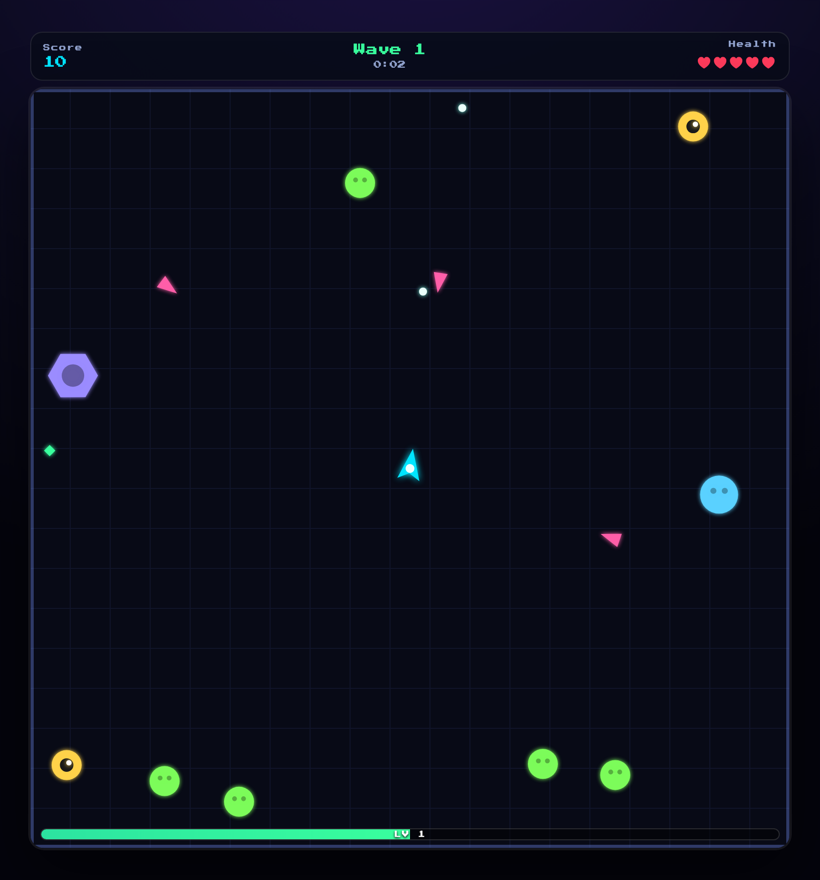

# Alienix 👾🕹️

> A twin-stick **arena survivor** — pilot a lone ship, survive endless alien swarms, level up and pick upgrades, and climb the online leaderboard.

[](https://danmat.github.io/Alienix/)
&nbsp;


<p align="center">
  
</p>

## What is it?

The original Alienix was a simple top-down space shooter. This is a ground-up
reimagining as a **twin-stick arena survivor** (think Geometry Wars / Vampire
Survivors): you're stuck in an arena, aliens close in from **every edge**, and
you survive as long as you can while your ship grows stronger.

- 🚀 **Move** with WASD / arrow keys (or drag on touch).
- 🎯 Your ship **auto-fires** — aim with the mouse, or it auto-targets the nearest alien.
- 💎 Kills drop **XP gems**. Collect them to **level up** and choose an **upgrade**.
- 🌊 Every 30 seconds a new **wave** ramps up; watch for **elites** and **bosses**.
- 🏆 Survive for a high score and enter your initials on the **leaderboard**.

## Enemies

| Alien | Behavior |
| --- | --- |
| 🟢 **Grunt** | Slow chaser |
| 🔺 **Dart** | Fast, weaves toward you |
| 👁️ **Eye** | Keeps its distance and shoots |
| 🟣 **Hex** | Tanky, takes many hits |
| 🔵 **Splitter** | Splits into two on death |
| 💀 **Boss** | Huge, multi-hit, fires spreads |

## Upgrades

Level up to pick from: Overclock (fire rate), Sharp Rounds (damage), Split Shot
(+projectile), Piercing, Thrusters (move speed), Reinforce (+max health), Magnet
(pickup range), Railgun (shot speed) and Nanobots (health regen). Stack them into
your own build.

## Controls

| Action | Input |
| --- | --- |
| Move | WASD · Arrow keys · Touch drag |
| Aim | Mouse (else auto-aim nearest) |
| Fire | Automatic |
| Pause | <kbd>P</kbd> or <kbd>Esc</kbd> |

## High scores

High scores go to a **shared Cloudflare leaderboard** — a Worker + D1
([retroix-leaderboard](https://github.com/DanMat/retroix-leaderboard)) shared by all of
Dan's Retroix games and namespaced by `gameId`, so this game's board is its own. It
works out of the box (no account, no setup) and validates + caps scores server-side.
Blank `apiUrl` in [`js/config.js`](js/config.js) to fall back to a local
(per-browser) board.

> Any client-side leaderboard can be spoofed by a determined player — it's for fun, not competition.

## Play locally

It's a static site — no build step:

```bash
git clone https://github.com/DanMat/Alienix.git
cd Alienix
python3 -m http.server 8000   # then visit http://localhost:8000
```

## How it works

| File | Responsibility |
| --- | --- |
| `js/game.js` | Canvas engine: movement, aiming, enemy AI, XP/level-up, waves, bosses. All art is drawn procedurally — no image assets. |
| `js/config.js` | Leaderboard API URL and game id. |

## Credits

Reimagined in vanilla JavaScript from the original 2011 jQuery shooter.

## License

[MIT](LICENSE) © DanMat
